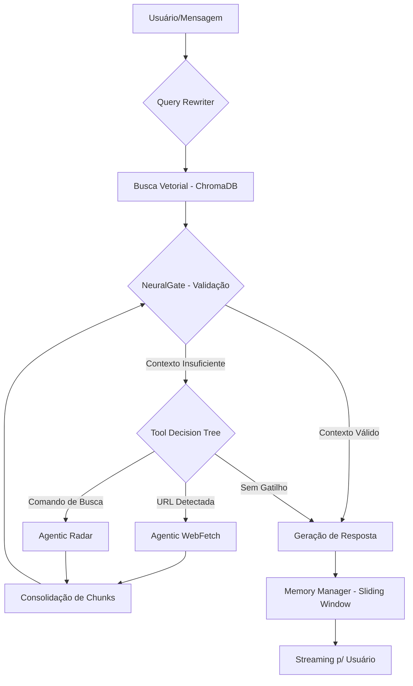

# 🧠 NeuralRAG: Project Context Derivative (PCD)

> **Versão:** 1.0.0  
> **Status:** Ativo - Sincronizado com Repositório  
> **Módulo:** Core Orchestration & NeuralGate Analysis

---

## 1. System Blueprint (Visão 360°)

| Camada | Tecnologia | Papel Estratégico |
| :--- | :--- | :--- |
| **API/Gateway** | FastAPI (Python) | Interface de alta performance com suporte a streaming e telemetria. |
| **Orquestração** | NeuralRAG (Custom) | Cérebro lógico: gerencia ferramentas, memória e fluxo de RAG. |
| **Vetorização** | ChromaDB (Persistent) | Datalake estruturado para recuperação semântica de baixa latência. |
| **Extração Externa** | Agentic API (AWS) | Blindagem operacional: fetch e radar com extração L12/L34. |
| **Embeddings** | text-embedding-3-small | Dimensão 512, otimizado para custo e precisão (OpenAI). |
| **LLM** | GPT-4o-mini | Motor de decisão e síntese com Tool-First Intelligence. |

---

## 2. Logic Constraints (Regras de Ouro)

### 2.1. Princípios de Desenvolvimento
*   **Encapsulamento de I/O**: Toda comunicação com APIs externas deve passar por métodos internos protegidos com tratamento de encoding (UTF-8/ASCII fallback).
*   **Fidelidade Sistêmica**: O `fidelity_threshold` deve ser o guardião da qualidade. Chunks abaixo do limiar (atualmente 0.6) devem ser descartados silenciosos.
*   **Tool-First Intelligence**: O sistema deve priorizar ferramentas para URLs e comandos de busca, mas economizar em conceitos estáveis.

### 2.2. Restrições de Refatoração
*   **Zero Leakage**: Chaves de API nunca devem ser hardcoded (uso obrigatório de `.env`).
*   **Consolidação de Chunks**: O sistema deve preferir `semantic_chunks` sobre `markdown_body` bruto para economizar banda AWS.

---

## 3. Grafo de Arquitetura de Processamento (Core Flow)

---

## 4. Strategic Weights (Prioridades)

1.  **Hardening da Extração**: Otimizar a "peneira" da Agentic API para evitar 502/404 em buscas legítimas (Ajustar limiar de fidelidade).
2.  **Modularidade de Clientes**: Preparar o `rag_service.py` para receber coleções dinâmicas por ID de cliente.
3.  **Monitoria de Custos**: Implementar telemetria de economia de tokens por compressão de memória.
