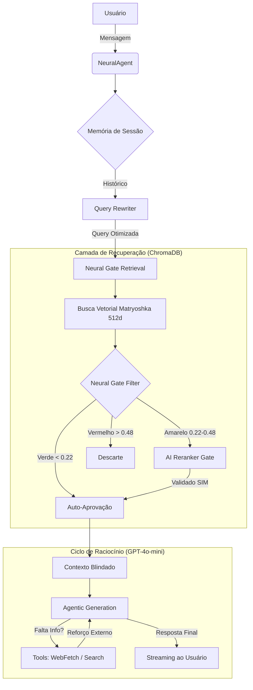

# NeuralRAG: Arquitetura e Operação Elite

Este documento define a espinha dorsal técnica, os agentes e o fluxo operacional do ecossistema **NeuralRAG**. Qualquer desvio deste padrão compromete a integridade da "Blindagem Operacional".

> [!IMPORTANT]
> **ORDEM DO COMANDANTE:** Somente criar modificações ou refatorações neste sistema sob ordem direta do comandante.

---

## 1. Detalhamento dos Agentes

O sistema é composto por agentes especializados que operam em harmonia:

- **NeuralAgent (API Gateway & Orquestrador):** Gerencia o ciclo de vida das requisições via FastAPI, mantém a persistência de sessão e orquestra os processos de `NeuralSync` e `Chat`.
- **NeuralSync (Operador de Ingestão):** Responsável pelo pipeline purificado de dados. Atua no fluxo: `Fetch -> Purify -> Ingest`. Utiliza a infraestrutura L12/L34 da Agentic API para extração furtiva.
- **IngestorAgent (Engenheiro de Vetores):** Especialista em transformação de dados. Realiza a sanitização de nomes de coleções e a injeção massiva de chunks semânticos no ChromaDB.
- **NeuralRAG Core (O Cérebro):** Executa o raciocínio complexo. Inclui o **Query Rewriter**, o **Neural Gate Retrieval** e o **Agentic Generator** (que decide autonomamente sobre o uso de ferramentas de busca).

---

## 2. Fluxo do Sistema RAG (Arquitetura e Infraestrutura)

O fluxo de processamento segue uma arquitetura de "Camadas de Defesa":

### Infraestrutura Base:
- **Compute:** FastAPI em ambiente containerizado.
- **Vector DB:** ChromaDB Persistente (Caminho: `data/vector_db`).
- **Intelligence:** Modelos OpenAI (GPT-4o-mini para lógica, text-embedding-3-small para vetores).
- **Extraction API:** Integração com Agentic WebFetch (L12/L34) para bypass de WAF.

---

## 3. Algoritmos e Regras de Operação

O NeuralRAG não é um RAG comum; ele utiliza algoritmos de precisão militar:

### A. Matryoshka Embeddings (512d)
Utilizamos o modelo `text-embedding-3-small` otimizado para **512 dimensões**. Isso garante um equilíbrio perfeito entre velocidade de busca e precisão semântica, permitindo escala horizontal sem perda de qualidade.

### B. Neural Gate (Tiered Filtering)
O filtro de entrada de contexto opera em três zonas de calor baseadas na distância vetorial:
- **Zona Verde (Distância < 0.22):** Chunks com alta similaridade são aprovados automaticamente.
- **Zona Amarela (0.22 ≤ Distância ≤ 0.48):** Chunks "suspeitos" são escalados para o **AI Reranker**.
- **Zona Vermelha (Distância > 0.48):** Chunks irrelevantes são eliminados sumariamente para evitar "alucinação por ruído".

### C. AI Bouncer (Binary Reranking)
Os candidatos da Zona Amarela são processados em **paralelo** por um classificador binário ultra-rápido que responde apenas `[SIM]` ou `[NAO]` sobre a relevância do chunk para a pergunta atual.

### D. Strict Mode (Blindagem de Conhecimento)
O sistema opera sob o regime de **Strict Mode**:
1. Prioridade absoluta ao contexto extraído.
2. Proibição de uso de conhecimento prévio do modelo (evita alucinações).
3. Uso compulsório de `neuralsafety_search_and_fetch` se o banco local estiver vazio ou insuficiente.

---

## 4. Governança

> [!CAUTION]
> **Qualquer alteração nos prompts de sistema, limiares de distância (thresholds) do Neural Gate ou na estrutura de dimensões de embedding deve ser aprovada e registrada como uma nova Ordem de Serviço (OS).**

**Somente criar modificações com ordem do comandante.**
